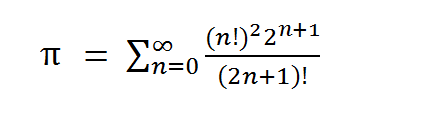

# PI calculate
- In this exercise, we are going to calculate the Pi number amount with 1000-digit accuracy. we will use multithreading to improve the performance and speed of the program. also, BigDecimal and MathCotext classes will help us. a way to calculate the exact amount of Pi is this formula:

- I made 8000 task and execute them in FixedThreadPool that has 16 thread.
- I managed race condition with synchronized function.
# Priority Simulator
- In this exercise, we will learn to manage threads with the CountDownLatch class. I built a static CountDownLatch in the Runner Class named counter. Then before every for loop, I initialized the counter. and after the loop, I used await () method. so the main thread will continue when one of the colors ended.
- We can use Threadpool intead of countdownlatch.
# Semaphore
- This exercise is for learning Semaphore. I added a Semaphore to the Operator Class to permit two threads to go into the critical section. when a thread wants to get into the critical section, calls acquire() method. if two threads call it, semaphore won't permit others to go to critical section.